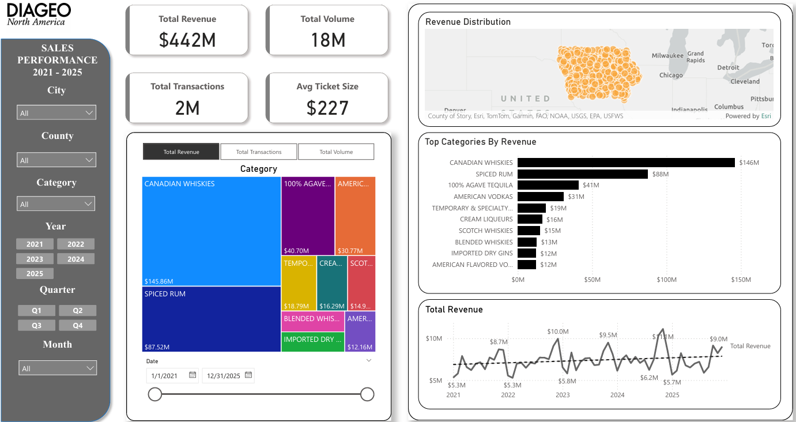

# 🍷 Diageo Sales Analytics & ETL Pipeline (2021-2025)


## 📊 Project Overview
This project is an **End-to-End Data Engineering & Analytics** solution designed to analyze alcohol sales data in Iowa, specifically focusing on the vendor **Diageo Americas**. The project encompasses automated data extraction from a public API, rigorous data cleaning using Python, and interactive visualization using Power BI.

**Dataset:** Iowa Liquor Sales (Public API)
**Data Volume:** >1 Million Rows (2021 - 2025)
**Objective:** To analyze revenue trends, product category performance, and geographical sales distribution.


*(Power BI Dashboard View)*

---

## ℹ️ Data Source & Acknowledgements
This project utilizes public data provided by the State of Iowa.
* **Dataset Name:** [Iowa Liquor Sales](https://data.iowa.gov/Sales-Distribution/Iowa-Liquor-Sales/m3tr-qhgy/about_data)
* **Provider:** Iowa Department of Commerce, Alcoholic Beverages Division.
* **Platform:** Iowa Open Data (Socrata).
* **License:** Public Domain / Open Data.

---

## 🛠️ Tech Stack & Tools
* **Language:** Python 3.12+
* **ETL & Manipulation:** Pandas, Requests
* **Data Storage:** CSV (Local Staging)
* **Visualization:** Microsoft Power BI
* **Version Control:** Git & GitHub

---

## ⚙️ ETL Architecture (Extract, Transform, Load)

### 1. Extraction
Developed a Python script (`src/data_script.py`) to fetch data from the **Iowa Open Data API (Socrata)**.
* Implemented **Pagination** (Limit & Offset) to handle millions of rows efficiently without timeout issues.
* Applied **Server-side Filtering** (`$where`) to extract only "DIAGEO AMERICAS" data within the 2021-2025 timeframe.

### 2. Transformation
Executed a strict data cleaning process to ensure data integrity:
* **Handling "Ghost Rows":** Utilized **Regex** to eliminate anomaly rows where category columns contained random numbers (e.g., '6' or '750').
* **Fixing CSV Structure:** Removed hidden *newline characters* (`\n`) in the Address column that previously corrupted the CSV row structure.
* **Data Type Enforcement:** Converted date and numeric columns, and standardized ZIP Code formats.
* **Standardization:** Standardized text fields (Upper case, Strip whitespace) for consistent city and store naming.

### 3. Loading & Modeling
Clean data is stored in CSV format and loaded into Power BI using a **Star Schema** architecture to optimize query performance:
* **Fact Table:** `Fact_Sales` (Contains quantitative transactional data).
* **Dimension Tables:**
  * `Dim_Date`: Dedicated calendar table for Time Intelligence analysis.
  * `Dim_Product`: Normalized product details (`category_name`, `item_description`, `pack`, `bottle_volume_ml`).
  * `Dim_Store`: Store location details (`city`, `county`, `zip_code`, `Location_Key`) to support geospatial analysis.
* **Measures:** Implemented 4 key Explicit DAX Measures:
  * `Total Revenue` ($)
  * `Total Volume` (Liters)
  * `Total Transactions` (Count)
  * `Avg Ticket Size` ($ per Transaction)

---

## 📈 Key Insights
Based on the dashboard analysis:
1.  **Top Category:** *Canadian Whiskies* and *Spiced Rum* dominate the sales volume.
2.  **Geographical Trend:** Highest sales are concentrated in the Des Moines metropolitan area (Polk County).
3.  **Sales Trend:** Sales patterns show significant seasonality with a spike in Q4 (End of Year).

---

## 🚀 How to Run

### Prerequisites
* Python 3.10+ installed.
* Power BI Desktop.

### Installation
1.  **Clone Repository**
    ```bash
    git clone https://github.com/AdityaAksar/diageo-sales-analytics.git
    cd diageo-sales-analytics
    ```

2.  **Install Dependencies**
    ```bash
    pip install pandas requests
    ```

3.  **Run ETL Script**
    This script will download the latest data from the API and generate the `data/diageo_2021_2025.csv` file.
    ```bash
    python src/data_script.py
    ```

4.  **Open Dashboard**
    Open `dashboard/diageo-dashboard.pbix` using Power BI Desktop.
    *(Note: You may need to refresh the data source to point to your local CSV file)*.

---

## 📂 Project Structure
```text
.
├── dashboard/          # Power BI File (.pbix)
├── data/               # Data storage folder (ignored by git)
├── images/             # Screenshots for documentation
├── src/                # Python Source Code (ETL script)
└── README.md           # Project Documentation
```

## 👤 Author
**Aditya Zaldy**
* Email: adityaaksar40@gmail.com
